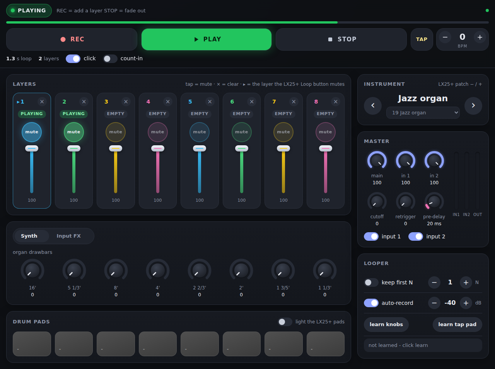
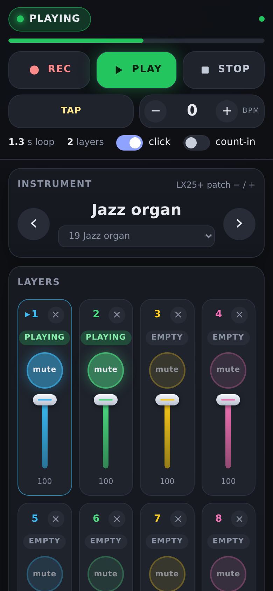

# LiveLoopSynth (Raspberry-Pi-Looper-synth-drum-thing)

An 8-track live looper with drum sampler, synths and FX, built in Pure Data vanilla.
It runs in two modes from the same patch:

| | **Mac mode** | **Raspberry Pi mode** |
|---|---|---|
| Start with | `scripts/run-mac.command` (or open `piLooper/LiveLoopSynth.pd` in Pd) | `scripts/run-pi.sh` |
| Audio | CoreAudio, device chosen in Pd's Audio Settings | ALSA, the UMC22 is picked automatically |
| MIDI | Keyboard chosen in Pd's MIDI Settings | ALSA MIDI, the keyboard is connected automatically |
| Screen | Pd window | Pd window on the Pi's monitor, optional autostart at login |

Hardware it's set up for:

- **Controller:** Nektar Impact LX25+ (USB MIDI)
- **Audio interface:** Behringer U-Phoria UMC22 (USB). Input 1 is the XLR mic jack and input 2 is the 1/4" instrument/line jack. Both go into the loopers and the output drives your speakers or headphones.

**New here? Read the [user manual](docs/USER_MANUAL.md).** Developer notes, architecture and to-do list: [docs/PROJECT_NOTES.md](docs/PROJECT_NOTES.md).

This is a fork of otem's [Raspberry Pi Looper synth drum thing](https://github.com/otem/Raspberry-Pi-Looper-synth-drum-thing), via megalon's MIDI-controller version.

## Drum kits

Two kits come with the project, in `piLooper/kits/`:

- **Bank 0:** GMRockKit (GPL, from the Hydrogen drum machine)
- **Bank 1:** Virtuosity Drums (CC0)

Each kit has eight sounds on the LX25+ pads, with the same layout on both pad maps: kick, snare, closed hi-hat, open hi-hat, rimshot, high tom, low tom, ride. See [`piLooper/kits/README.md`](piLooper/kits/README.md) for the pad-to-note map, credits and licenses.

**AI drummer:** with **drummer** ticked, it plays the selected kit along with your loop. You hear it, but it's never recorded. While it's on, the pads pause it, ask for a fill, or change the groove. See the [user manual, section 11](docs/USER_MANUAL.md#11-the-ai-drummer).

Drum banks 2 and 3 still use their own samples, which aren't included. To use them, add `.wav` files to `piLooper/` named `kick_13.wav`–`kick_24.wav`, `snare_13.wav`–`snare_24.wav`, `hh_07.wav`–`hh_12.wav` and `crash_03.wav`–`crash_04.wav`.

Pd plays samples at its own sample rate, so keep Pd at 48 kHz (both modes below use it). Otherwise the drums play off-pitch.

## Mac mode

1. Install [Pd vanilla](https://puredata.info/downloads) 0.52 or newer.
2. In Pd: **Help → Find externals**, search for `zexy` and install it.
3. Plug in the UMC22 and the Impact LX25+.
4. Double-click `scripts/run-mac.command`, or open `piLooper/LiveLoopSynth.pd` in Pd. If macOS asks whether Pd may use the microphone, click **Allow**. Without that, the UMC22 inputs are silent.
5. **Media → Audio Settings:** set the input and output device to the UMC22 (it may be listed as *USB Audio CODEC*), 2 channels in and out, 48000 Hz. Click **Save All Settings**.
6. **Media → MIDI Settings:** set input device 1 to *Impact LX25+*. Click **Save All Settings**.

You only need to do steps 5 and 6 once.

## Raspberry Pi mode

Needs Raspberry Pi OS **Bookworm or newer** (desktop), because song saving relies on Pd 0.52+.

```sh
git clone <this repo> && cd Raspberry-Pi-Looper-synth-drum-thing
scripts/setup-pi.sh               # installs puredata, pd-zexy, alsa-utils; adds you to the audio group
# or: scripts/setup-pi.sh --autostart   # also launches it when the desktop logs in
```

Log out and back in once so the audio group takes effect. Then plug in the UMC22 and the LX25+ and run:

```sh
scripts/run-pi.sh
```

The script:

- finds the UMC22 in Pd's ALSA device list and uses it for input and output (2 channels, 48 kHz)
- starts Pd with the patch
- connects the Impact LX25+ to Pd's MIDI input

It prints a warning and carries on if either device is missing.

Settings, as environment variables:

| Variable | Default | What it does |
|---|---|---|
| `AUDIO_DEVICE` | `UMC22\|USB Audio CODEC` | Regex matched against Pd's audio device names |
| `AUDIO_DEV` | – | Pd device number; overrides `AUDIO_DEVICE` |
| `MIDI_DEVICE` | `Impact` | Part of the ALSA MIDI client name to connect |
| `SAMPLE_RATE` | `48000` | |
| `AUDIO_BUF` | `20` | Audio buffer in ms. Raise it (e.g. `40`) if you hear clicks |
| `REMOTE_PORT` | `8080` | Web remote port (with `--remote` / `--headless`) |

`scripts/run-pi.sh --list` shows the audio and MIDI devices Pd and ALSA can see.

## Web remote (phone, tablet or browser)

A modern control surface for the looper, served by the Pi (or the Mac) to any browser on the same network. It shows the looper state, transport, tempo, the 8 layers with mute/clear/volume, the knob pages, instrument, master levels, meters and drum pads. Everything stays in sync with the LX25+ and the Pd window.

| Desktop | Phone |
|---|---|
|  |  |

```sh
scripts/run-pi.sh --remote      # Pd window + web remote
scripts/run-pi.sh --headless    # web remote only, no Pd window
scripts/setup-pi.sh --autostart --headless   # start that way at login
```

On the Mac, start the patch as usual and run `python3 remote/server.py` in a terminal.

Then open `http://<pi-name>.local:8080/` (e.g. `http://raspberrypi.local:8080/`) on your phone. The server also prints the address. **Add to Home Screen** makes it open full-screen like an app.

- **No extra software:** it uses only Python's standard library, and the page is plain HTML/CSS/JS with no internet needed.
- **How it connects:** the patch's `[remote]` object listens on `127.0.0.1:9311` (this computer only). `remote/server.py` bridges it to the browser over a WebSocket, and only lets through the controls listed in `remote/names.json`.
- **Who can use it:** anyone on the same Wi-Fi can open the page, and there's no password. Use `--host 127.0.0.1` (or `REMOTE_HOST=127.0.0.1`) to keep it on the local machine, or `REMOTE_PORT` to change the port.

## Using it

- **IN1 / IN2** (under the input meters) switch the UMC22's two inputs into the loopers. Both start on. Input gain is set from the controller. The `l-in-vol` / `r-in-vol` sliders only display it.
- The big buttons record each of the 8 loops, the slider next to each sets its volume, and the small red button clears it. The tall sliders control the FX.
- Songs are saved as folders in `piLooper/Sessions/`.

### Instruments

The two instrument buttons on the LX25+ step through 25 banks. The selected bank's name is shown above the instrument column in the main window.

| Bank | Instrument | Bank | Instrument |
|---|---|---|---|
| 0 | GMRock kit | 16 | Moog bass |
| 1 | Virtuosity kit | 17 | Acid bass (resonant, with glide) |
| 2–3 | Drum kits 3–4 (your own samples) | 18 | Reese bass (detuned saws + sub) |
| 4 | Lead synth | 19 | Jazz organ (888000000, 3rd-harmonic percussion, slow Leslie) |
| 5–7, 9–11, 13–15 | FM synth presets 1–9 | 20 | Gospel organ (all drawbars, fast Leslie) |
| 8 | Lead synth 2 | 21 | Church organ (principal chorus, slow attack) |
| 12 | Synth 3 | 22 | Supersaw lead |
| | | 23 | Warm pad |
| | | 24 | Pluck |

Banks 16–18 and 22–24 come from `analogSynth.pd`, a 4-voice subtractive synth. Banks 19–21 come from `organSynth.pd`, a 4-voice drawbar organ. Each engine turns its DSP off while another instrument is selected, which saves CPU on the Pi. The presets are the message boxes inside those two files, and the parameter list is written next to them.

### MIDI mapping

MIDI is handled in `[pd internals]` inside `LiveLoopSynth.pd`. `[pd midi-io]` reads the controller, and `[pd instrument-select]`, `[pd loop-control]` and `[pd loop-select]` map the LX25+ buttons. The drum pads play notes 48–63 across the LX25+'s two pad maps. The `print midi-raw-*` objects in `[pd midi-io]` show what each control sends in the Pd console.
