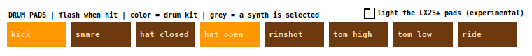

# LiveLoopSynth user manual

LiveLoopSynth is a live looper with drum kits, synths and effects. You play it from a Nektar Impact LX25+ keyboard, record through a Behringer UMC22 audio interface, and it runs on a Mac or a Raspberry Pi with a monitor. You build a song by stacking up to 8 **layers** over one loop. Everything you play is heard live, and it's only added to the loop while you're recording.

## 1. Starting up

| | Mac | Raspberry Pi |
|---|---|---|
| Start | Double-click `scripts/run-mac.command` | `scripts/run-pi.sh`, or automatically at login if you ran `scripts/setup-pi.sh --autostart` |
| First time only | In Pd: **Media → Audio Settings**, pick the UMC22 (it may show as *USB Audio CODEC*) for input and output at 48000 Hz. **Media → MIDI Settings**, pick *Impact LX25+*. Click **Save All Settings** in both. Allow microphone access if macOS asks. | Nothing: the script finds the UMC22 and the LX25+ itself. |

Plug the UMC22 and the LX25+ in before you start. When the window opens, the big box in the top-left says **READY**.

The UMC22 has two inputs:

- **Input 1:** the XLR mic socket.
- **Input 2:** the 1/4" instrument/line socket.

Set their gain with the knobs on the UMC22. The **IN1/IN2** meters in the bottom-right show the signal, and the two **inputs on** tick boxes under them switch each input into the looper (both start on).

## 2. The screen

**Top row: what the looper is doing**

- **State box (top-left).** A big, color-coded word:

  | State | Color | Meaning |
  |---|---|---|
  | READY | grey | empty, waiting for you to play |
  | RECORDING | red | recording the first layer, which sets the loop length |
  | OVERDUB | orange | adding to a layer |
  | PLAYING | green | looping, not recording (play-through) |
  | FADING | blue | fading out |
  | STOPPED | dark | stopped |

- **Hint line.** Under the position bar, it says what the next button press will do.
- **Loop position.** The marker sweeps from left to right once per loop. While you record the first layer it shows how much of the 20-second maximum you've used.
- **Loop length (s)** and **layers used.**
- **Tempo controls:**
  - **TAP** and its light.
  - **bpm:** type a value, or 0 for no tempo.
  - **click** and **count-in** switches.

  See section 5.
- **Instrument box (top-right).** The instrument the keys and pads are playing.

**LAYERS: eight columns, one per layer**

- **The colored cell** shows each layer's state:

  | Cell | Meaning |
  |---|---|
  | empty | nothing recorded |
  | playing | has sound and is audible |
  | REC | being recorded right now |
  | muted | silenced by you or by "keep first N" |

  A **>** in front marks the layer the LX25+ **Loop** button will mute.
- **mute** (big round button): mute/unmute that layer.
- **clear** (small red button): erase that layer.
- **vol**: the layer's volume.

**Looper controls**

- **REC**, **PLAY** and **STOP** do the same as the LX25+ transport buttons (next section).
- **keep first N** and **N**: see section 6.
- **auto-record** and **threshold dB**: see section 4.

**Knob rows.** Two rows of eight sliders, which follow the LX25+ knobs. The row the knobs last moved is highlighted.

- **SYNTH KNOBS (Inst mode):** sound settings for the selected instrument. The labels change with the instrument (section 7).
- **INPUT FX KNOBS (Preset mode):** reverb and delay amounts for the mic input, input 2 and the synths/drums, plus delay time and feedback (section 7).

Next to the looper controls are **learn knobs** (section 7) and two master effects. **Master cutoff** is a low-pass filter over everything you play: lower it for a darker, muffled sound. **Retrigger** is a stutter effect that repeats short slices in time with the loop.

**DRUM PADS.** A row of eight pads that flash when you hit them. They're colored by drum kit: GMRock orange, Virtuosity teal, your own kits 2 and 3 purple and blue. They turn grey when a synth is selected, because the pads then play that synth.

**Right column**

- **INSTRUMENT BANK:** the selected instrument is filled in. Change it with the LX25+ **Patch − / +** buttons.
- **Meters:** IN1, IN2 and OUT.
- **LEVELS:** display only. They show main volume, input gains and FX sends.

## 3. LX25+ controls

| LX25+ control | What it does |
|---|---|
| **Keys / pads** | Play the selected instrument (drum kits respond to the pads and to keys C3-D#4). The pads play the drum kits (see [kits/README](../piLooper/kits/README.md) for the pad layout). |
| **Record** | Start recording. Press again to set the loop length and start the next layer. Each later press starts a new layer. |
| **Play** | Play-through: stop recording and keep the loop going, so you can play along without adding to it. It also restarts after a Stop. |
| **Stop** | Fade out over one loop, then stop. **Press again** to stop immediately. **Press while stopped** to clear everything. |
| **Fast-forward** | Keep first N on/off (section 6). Turning it off also unmutes every layer. |
| **Rewind** | Change N (1 → 2 → … → 7 → 1). |
| **Pad 8 on pad map 2** | **Tap tempo** while the looper is READY. While the first layer records, it **completes the loop** (same as Record), so you can close a loop without leaving the pads. |
| **Loop** | Mute/unmute the layer marked **>**. |
| **Track < / >** | Move the **>** marker to another layer. |
| **Patch − / +** | Change instrument (25 banks, listed in the right column). |
| **Pitch wheel** | Bends synth notes up to an octave up or down (analog synths, organs, FM presets). |
| **Mod wheel** | Vibrato on the analog synths and organs. |
| **Knobs 1–8** | Depends on the LX25+ knob mode (the **Mixer / Inst / Preset** buttons): **Inst** = synth sound, **Preset** = input reverb/delay, **Mixer** = layer volumes. See section 7. |
| **Fader** | Volume of layer N, where N is the MIDI channel the fader sends on (1–8). |

The patch expects these messages on MIDI channel 16 (the LX25+ in its DAW/Pd setup): Record CC 107, Play 106, Stop 105, Fast-forward 104, Rewind 103, Loop 102, Track < / > CC 109 / 110, Patch − / + CC 111 / 112, Inst-mode knobs CC 56–63. Preset-mode knobs are learned (section 7). If a button does nothing, watch the Pd console: the `midi-raw` lines show what each control actually sends.

### Lighting the LX25+ pads (experimental)

The screen always shows the pads lighting up. Whether the LX25+'s own pads can be lit by the software is untested; it depends on the keyboard accepting incoming MIDI. To try it:

1. **Connect the patch's MIDI output to the keyboard.** On the Pi, `run-pi.sh` does this for you. On the Mac, set **Media → MIDI Settings → Output device 1** to *Impact LX25+*.
2. **Tick "light the LX25+ pads (experimental)"** above the pad row.

Each pad hit is then sent back to the keyboard as a note with a different velocity per kit. If the pads light (or change color), it works. If nothing changes, the keyboard ignores incoming MIDI; untick it, and nothing is harmed.

## 4. Recording a loop, step by step

1. **Get to READY.** If the screen doesn't say READY, press **Stop** until it does. Stop fades out, then stops, then clears.
2. **Just start playing.** With **auto-record** ticked, recording starts on your first note (keys or pads) or when an input goes over the **threshold** (−40 dB by default). You can also press **Record** to start. The box turns red: **RECORDING**.
   - For about one second after clearing, auto-record ignores sound, so reverb tails don't trigger it.
   - If the room is noisy, raise the threshold (e.g. −30). If quiet playing doesn't trigger it, lower it.
3. **Press Record at the end of your phrase.** That moment sets the loop length (up to about 20 s), and the loop starts playing straight away. You're now in **OVERDUB** on layer 2: anything you play is added to layer 2 on every pass.
4. **Press Record again** to finish layer 2 and start layer 3, and so on up to 8 layers. A new layer starts exactly where you are in the loop, so there's no waiting for the downbeat.
5. **Press Play** when you want to jam over the loop without recording it (**PLAYING**, green). Press **Record** at any time to add another layer.
6. **Press Stop** to fade out over one loop. Press **Stop** again during the fade to cut immediately. Press **Play** to start again from the top, or **Stop** once more to clear everything and return to READY.

Overdub adds on every pass: if you keep playing the same part while a layer records, it gets louder each time around. Press **Record** (next layer) or **Play** (play-through) when a layer sounds right.

## 5. Tempo: tap, bar snapping, click and count-in (optional)

Without a tempo the looper works as described above: the loop is exactly as long as you play it (a *natural* loop). Set a tempo and loops become *timed*.

1. **Tap the tempo while the looper shows READY.** Tap pad 8 on pad map 2 (or click **TAP**) in time, four or more times. The bpm box shows the tempo from the second tap onward. It averages your last four taps, ignores a tap that's way off, and starts a fresh count after a 2-second pause. You can also type a bpm into the box; type 0 to go back to natural loops.
2. **Record as usual.** When you close the first layer (Record, or the tap pad), the loop length **snaps to the nearest whole number of bars** (4/4). Close a little early and it keeps recording to the bar line. Close a little late and playback carries on from the right place. Either way, the loop is in time.
3. **Click:** with **click** ticked, a metronome plays while the first layer records. The downbeat is higher-pitched. The click goes to the speakers only and is never recorded, and it stops once the loop plays.
4. **Count-in:** with **count-in** ticked, pressing **Record** in READY gives one bar of clicks (the hint line counts 1-2-3-4), then recording starts on the downbeat. Auto-record doesn't use the count-in, because it starts on your first note.
5. **The tempo is locked** once a loop exists; tapping then shows "tempo is locked". Clear everything (Stop until READY) to set a new one.

**With a tempo set:**

- **Natural loops:** the tap pad is also a hands-free "finish the loop" trigger while the first layer records.
- **Delay time:** Preset knob 7 picks a note value (1/16, 1/8, dotted 1/8, 1/4, dotted 1/4, 1/2). The slider label shows which.

**The tap pad.** By default it's note 55 on MIDI channel 10 (pad 8, pad map 2). It's silent: tapping plays no drum or synth note and doesn't start auto-record. If your keyboard sends something different, click **learn tap pad** and hit the pad; the patch remembers it (`piLooper/tappad.txt`). If the **G3 key** goes quiet, your pads and keys share a MIDI channel: set the LX25+ pads to their own channel and learn the tap pad again.

## 6. Breakdowns: keep first N

**Keep first N** mutes every layer above N with one press, and brings them back with the next. It's handy for a breakdown that drops back to, say, just the drums and bass.

1. Press **Rewind** until **N** shows how many layers to keep. For example, N = 2 keeps layers 1 and 2.
2. Press **Fast-forward**. Layers above N show **muted**. In the screenshot above, layer 3 is muted and layers 1–2 keep playing.
3. Press **Fast-forward** again to bring everything back. This also unmutes any layers you muted by hand.

To mute or unmute single layers, click a layer's **mute** button, or use **Track < / >** to move the **>** marker and press **Loop**.

## 7. The knobs

The LX25+ knob-mode buttons pick what the eight knobs do.

### Inst mode: shape the synth you're playing

The knobs control the instrument selected in the INSTRUMENT BANK:

| Instrument | Knob 1 | 2 | 3 | 4 | 5 | 6 | 7 | 8 |
|---|---|---|---|---|---|---|---|---|
| Basses, Supersaw, Warm pad, Pluck (banks 16–18, 22–24) | cutoff | resonance | filter env | attack | release | detune | LFO rate | LFO depth |
| Organs (banks 19–21) | 16' | 5 1/3' | 8' | 4' | 2 2/3' | 2' | 1 3/5' | 1 1/3' |
| FM presets (banks 5–7, 9–11, 13–15) | mod 1 amt | mod 2 amt | cross mod | attack | decay | release | LFO rate | LFO depth |
| Drum kits and the lead synths | – | | | | | | | |

- **When changes apply:** cutoff, resonance, filter env, detune and the drawbars change the sound immediately, even on held notes. Attack and release apply from the next note.
- **LFO:** LFO depth wobbles the filter, and LFO rate sets the speed.
- **Selecting an instrument restores its preset sound.**

**Wheels:**

- **Pitch wheel:** bends the analog synths, organs and FM presets up to an octave up or down.
- **Mod wheel:** adds vibrato to the analog synths and organs.

Neither affects the lead synths (banks 4, 8 and 12) or the drums.

### Preset mode: reverb and delay on your inputs

| Knob | 1 | 2 | 3 | 4 | 5 | 6 | 7 | 8 |
|---|---|---|---|---|---|---|---|---|
| | mic reverb | mic delay | input 2 reverb | input 2 delay | synth/drums reverb | synth/drums delay | delay time | delay feedback |

Each source has its own reverb and delay amount, and they share one reverb and one delay. Delay time runs from about 60 ms to 1.5 s, or follows the tempo (section 5). **Reverb pre-delay** (next to the INPUT FX title, 0-250 ms, default 20) sets how long the reverb waits before it starts, which keeps vocals and instruments clear in front of the reverb. The effects are recorded into the loop along with the dry sound.

**One-time setup: teach the patch your Preset-mode knobs.** The patch doesn't know in advance what the LX25+ sends in Preset mode, so:

1. Press **Preset** on the LX25+.
2. Click **learn knobs** on screen. The box next to it says *turn Preset knob 1*.
3. Turn knob 1, then knob 2, and so on up to knob 8. The box counts along and then shows *Preset knobs learned*.

This is saved in `piLooper/knobmap.txt` and loads at every start. To redo it, click **learn knobs** again.

### Mixer mode

The knobs and fader set layer volumes, as before.

The **mouse** works too: dragging any knob-row slider does the same as turning the knob.

## 8. Instruments

| Bank | Instrument | Bank | Instrument |
|---|---|---|---|
| 0 | GMRock kit | 16 | Moog bass |
| 1 | Virtuosity kit | 17 | Acid bass |
| 2–3 | Your own drum samples | 18 | Reese bass |
| 4 | Lead synth | 19 | Jazz organ |
| 5–7, 9–11, 13–15 | FM synth presets | 20 | Gospel organ |
| 8 | Lead synth 2 | 21 | Church organ |
| 12 | Synth 3 | 22 | Supersaw lead |
| | | 23 | Warm pad |
| | | 24 | Pluck |

You can change instrument while a layer is recording, for example to record a bass line and then pads into the next layer.

## 9. Saving and loading songs

Songs are saved as folders under `piLooper/Sessions/`, one audio file (stem) per layer plus the loop length. Loading a song brings back its layers and loop length. The looper then shows **STOPPED**, so press **Play**.

**Not yet mapped:** save, load, new song and song select were driven by the old Teensy front panel, and no LX25+ button triggers them yet.

## 10. Troubleshooting

| Problem | Try |
|---|---|
| No sound from the inputs | Check the UMC22 gain knobs, the **inputs on** ticks and the IN1/IN2 meters. On a Mac, allow microphone access for Pd (System Settings → Privacy & Security → Microphone). |
| Preset-mode knobs do nothing | Do the one-time learn in section 7. |
| G3 key is silent | Your pads and keys share a MIDI channel; see *The tap pad* in section 5. |
| Auto-record starts on its own | Raise the **threshold**, or untick **auto-record** and use the Record button. |
| Auto-record doesn't start | Lower the threshold, or press **Record**. |
| Drums sound out of tune | Pd must run at 48 kHz (Media → Audio Settings on a Mac; the Pi script sets it). |
| Clicks or crackles on the Pi | Start with a bigger buffer: `AUDIO_BUF=40 scripts/run-pi.sh`. |
| The LX25+ does nothing on the Pi | Run `scripts/run-pi.sh --list` to check the keyboard is listed, then restart the script. |
| A layer won't record | All 8 layers are used ("layers used" = 8). Clear a layer with its red button, or press Stop twice and Stop again to start over. |
