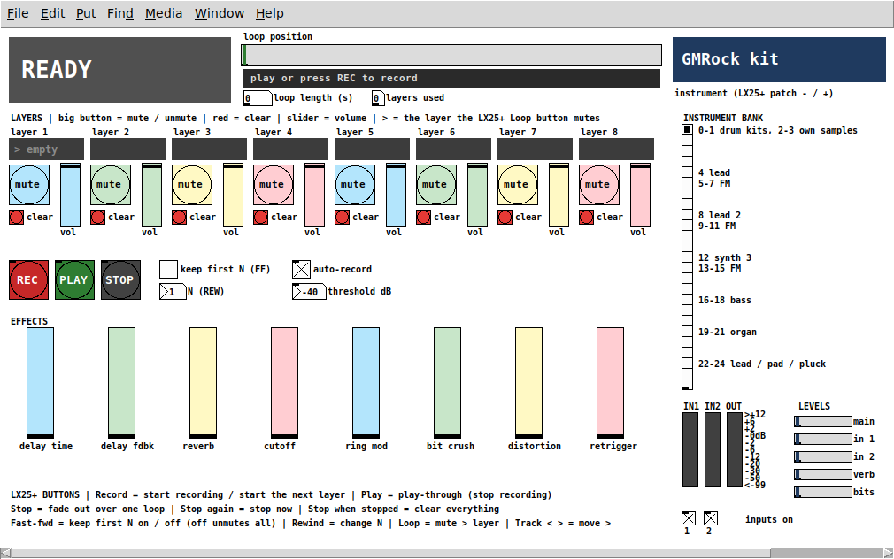
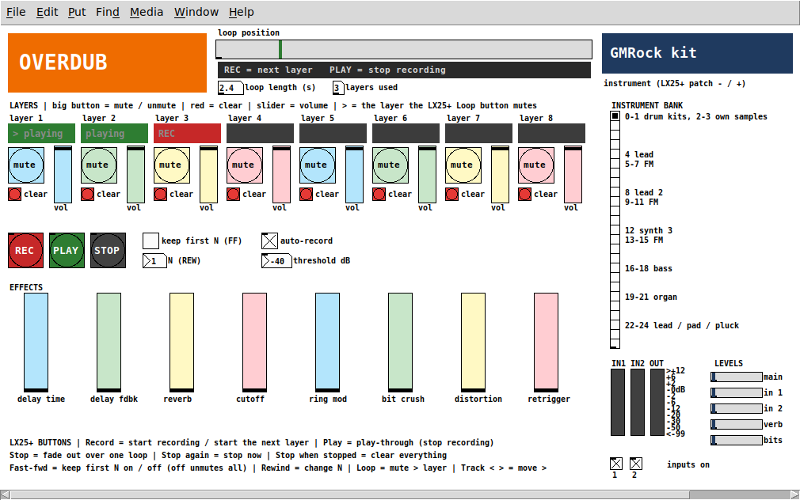
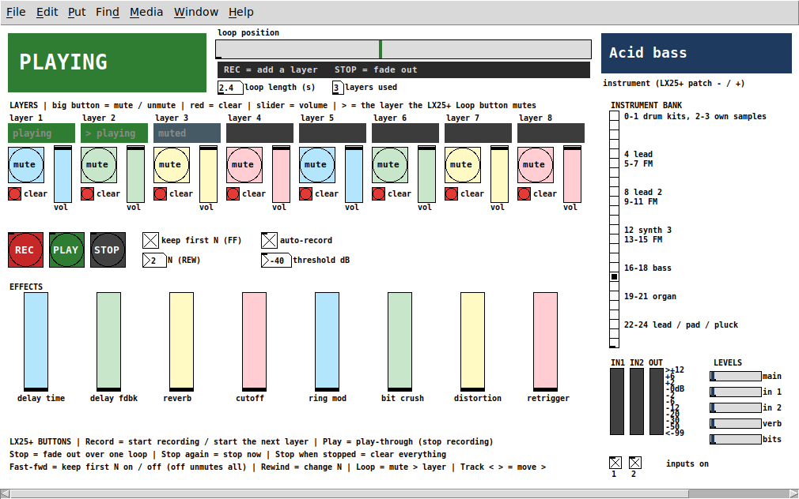

# LiveLoopSynth user manual

LiveLoopSynth is a live looper with drum kits, synths and effects. You play it from a Nektar Impact LX25+ keyboard, record through a Behringer UMC22 audio interface, and it runs on a Mac or a Raspberry Pi with a monitor. You build a song by stacking up to 8 **layers** over one loop. Everything you play is heard live, and it's only added to the loop while you're recording.

## 1. Starting up

| | Mac | Raspberry Pi |
|---|---|---|
| Start | Double-click `scripts/run-mac.command` | `scripts/run-pi.sh`, or automatically at login if you ran `scripts/setup-pi.sh --autostart` |
| First time only | In Pd: **Media → Audio Settings**, pick the UMC22 (it may show as *USB Audio CODEC*) for input and output at 48000 Hz. **Media → MIDI Settings**, pick *Impact LX25+*. Click **Save All Settings** in both. Allow microphone access if macOS asks. | Nothing: the script finds the UMC22 and the LX25+ itself. |

Plug the UMC22 and the LX25+ in before you start. When the window opens, the big box in the top-left says **READY**.

The UMC22 has two inputs:

- **Input 1:** the XLR mic socket.
- **Input 2:** the 1/4" instrument/line socket.

Set their gain with the knobs on the UMC22. The **IN1/IN2** meters in the bottom-right show the signal, and the two **inputs on** tick boxes under them switch each input into the looper (both start on).

## 2. The screen

**Top row: what the looper is doing**

- **State box (top-left).** A big, color-coded word:

  | State | Color | Meaning |
  |---|---|---|
  | READY | grey | empty, waiting for you to play |
  | RECORDING | red | recording the first layer, which sets the loop length |
  | OVERDUB | orange | adding to a layer |
  | PLAYING | green | looping, not recording (play-through) |
  | FADING | blue | fading out |
  | STOPPED | dark | stopped |

- **Hint line.** Under the position bar, it says what the next button press will do.
- **Loop position.** The marker sweeps from left to right once per loop. While you record the first layer it shows how much of the 20-second maximum you've used.
- **Loop length (s)** and **layers used.**
- **Instrument box (top-right).** The instrument the keys and pads are playing.

**LAYERS: eight columns, one per layer**

- **The colored cell** shows each layer's state:

  | Cell | Meaning |
  |---|---|
  | empty | nothing recorded |
  | playing | has sound and is audible |
  | REC | being recorded right now |
  | muted | silenced by you or by "keep first N" |

  A **>** in front marks the layer the LX25+ **Loop** button will mute.
- **mute** (big round button): mute/unmute that layer.
- **clear** (small red button): erase that layer.
- **vol**: the layer's volume.

**Looper controls**

- **REC**, **PLAY** and **STOP** do the same as the LX25+ transport buttons (next section).
- **keep first N** and **N**: see section 5.
- **auto-record** and **threshold dB**: see section 4.

**EFFECTS.** Eight effects on everything you play: delay time, delay feedback, reverb, cutoff, ring mod, bit crush, distortion and retrigger. The eight LX25+ knobs move these sliders.

**Right column**

- **INSTRUMENT BANK:** the selected instrument is filled in. Change it with the LX25+ **Patch − / +** buttons.
- **Meters:** IN1, IN2 and OUT.
- **LEVELS:** display only. They show main volume, input gains and FX sends.

## 3. LX25+ controls

| LX25+ control | What it does |
|---|---|
| **Keys / pads** | Play the selected instrument. The pads play the drum kits (see [kits/README](../piLooper/kits/README.md) for the pad layout). |
| **Record** | Start recording. Press again to set the loop length and start the next layer. Each later press starts a new layer. |
| **Play** | Play-through: stop recording and keep the loop going, so you can play along without adding to it. It also restarts after a Stop. |
| **Stop** | Fade out over one loop, then stop. **Press again** to stop immediately. **Press while stopped** to clear everything. |
| **Fast-forward** | Keep first N on/off (section 5). Turning it off also unmutes every layer. |
| **Rewind** | Change N (1 → 2 → … → 7 → 1). |
| **Loop** | Mute/unmute the layer marked **>**. |
| **Track < / >** | Move the **>** marker to another layer. |
| **Patch − / +** | Change instrument (25 banks, listed in the right column). |
| **Knobs 1–8** | The eight effects. |
| **Fader** | Volume of layer N, where N is the MIDI channel the fader sends on (1–8). |

The patch expects these messages on MIDI channel 16 (the LX25+ in its DAW/Pd setup): Record CC 107, Play 106, Stop 105, Fast-forward 104, Rewind 103, Loop 102, Track < / > CC 109 / 110, Patch − / + CC 111 / 112, knobs CC 56–63. If a button does nothing, watch the Pd console: the `midi-raw` lines show what each control actually sends.

## 4. Recording a loop, step by step

1. **Get to READY.** If the screen doesn't say READY, press **Stop** until it does. Stop fades out, then stops, then clears.
2. **Just start playing.** With **auto-record** ticked, recording starts on your first note (keys or pads) or when an input goes over the **threshold** (−40 dB by default). You can also press **Record** to start. The box turns red: **RECORDING**.
   - For about one second after clearing, auto-record ignores sound, so reverb tails don't trigger it.
   - If the room is noisy, raise the threshold (e.g. −30). If quiet playing doesn't trigger it, lower it.
3. **Press Record at the end of your phrase.** That moment sets the loop length (up to about 20 s), and the loop starts playing straight away. You're now in **OVERDUB** on layer 2: anything you play is added to layer 2 on every pass.
4. **Press Record again** to finish layer 2 and start layer 3, and so on up to 8 layers. A new layer starts exactly where you are in the loop, so there's no waiting for the downbeat.
5. **Press Play** when you want to jam over the loop without recording it (**PLAYING**, green). Press **Record** at any time to add another layer.
6. **Press Stop** to fade out over one loop. Press **Stop** again during the fade to cut immediately. Press **Play** to start again from the top, or **Stop** once more to clear everything and return to READY.

Overdub adds on every pass: if you keep playing the same part while a layer records, it gets louder each time around. Press **Record** (next layer) or **Play** (play-through) when a layer sounds right.

## 5. Breakdowns: keep first N

**Keep first N** mutes every layer above N with one press, and brings them back with the next. It's handy for a breakdown that drops back to, say, just the drums and bass.

1. Press **Rewind** until **N** shows how many layers to keep. For example, N = 2 keeps layers 1 and 2.
2. Press **Fast-forward**. Layers above N show **muted**. In the screenshot above, layer 3 is muted and layers 1–2 keep playing.
3. Press **Fast-forward** again to bring everything back. This also unmutes any layers you muted by hand.

To mute or unmute single layers, click a layer's **mute** button, or use **Track < / >** to move the **>** marker and press **Loop**.

## 6. Instruments

| Bank | Instrument | Bank | Instrument |
|---|---|---|---|
| 0 | GMRock kit | 16 | Moog bass |
| 1 | Virtuosity kit | 17 | Acid bass |
| 2–3 | Your own drum samples | 18 | Reese bass |
| 4 | Lead synth | 19 | Jazz organ |
| 5–7, 9–11, 13–15 | FM synth presets | 20 | Gospel organ |
| 8 | Lead synth 2 | 21 | Church organ |
| 12 | Synth 3 | 22 | Supersaw lead |
| | | 23 | Warm pad |
| | | 24 | Pluck |

You can change instrument while a layer is recording, for example to record a bass line and then pads into the next layer.

## 7. Saving and loading songs

Songs are saved as folders under `piLooper/Sessions/`, one audio file (stem) per layer plus the loop length. Loading a song brings back its layers and loop length. The looper then shows **STOPPED**, so press **Play**.

**Not yet mapped:** save, load, new song and song select were driven by the old Teensy front panel, and no LX25+ button triggers them yet.

## 8. Troubleshooting

| Problem | Try |
|---|---|
| No sound from the inputs | Check the UMC22 gain knobs, the **inputs on** ticks and the IN1/IN2 meters. On a Mac, allow microphone access for Pd (System Settings → Privacy & Security → Microphone). |
| Auto-record starts on its own | Raise the **threshold**, or untick **auto-record** and use the Record button. |
| Auto-record doesn't start | Lower the threshold, or press **Record**. |
| Drums sound out of tune | Pd must run at 48 kHz (Media → Audio Settings on a Mac; the Pi script sets it). |
| Clicks or crackles on the Pi | Start with a bigger buffer: `AUDIO_BUF=40 scripts/run-pi.sh`. |
| The LX25+ does nothing on the Pi | Run `scripts/run-pi.sh --list` to check the keyboard is listed, then restart the script. |
| A layer won't record | All 8 layers are used ("layers used" = 8). Clear a layer with its red button, or press Stop twice and Stop again to start over. |
