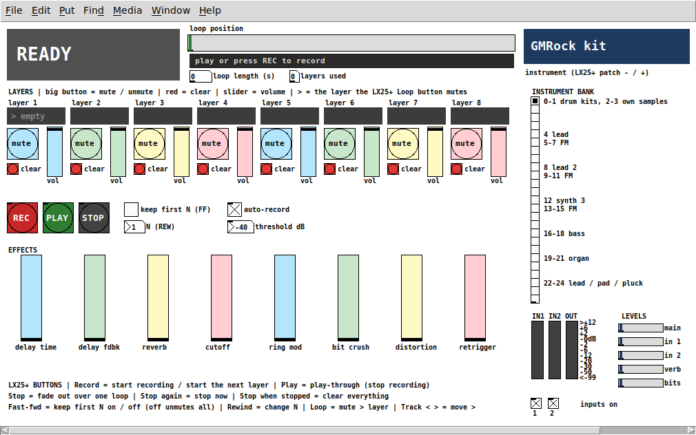
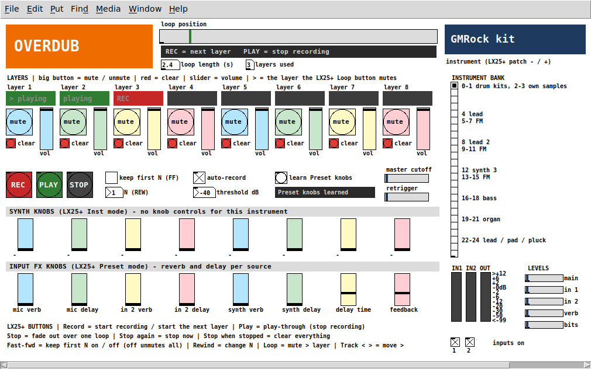
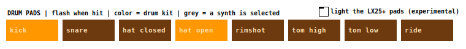
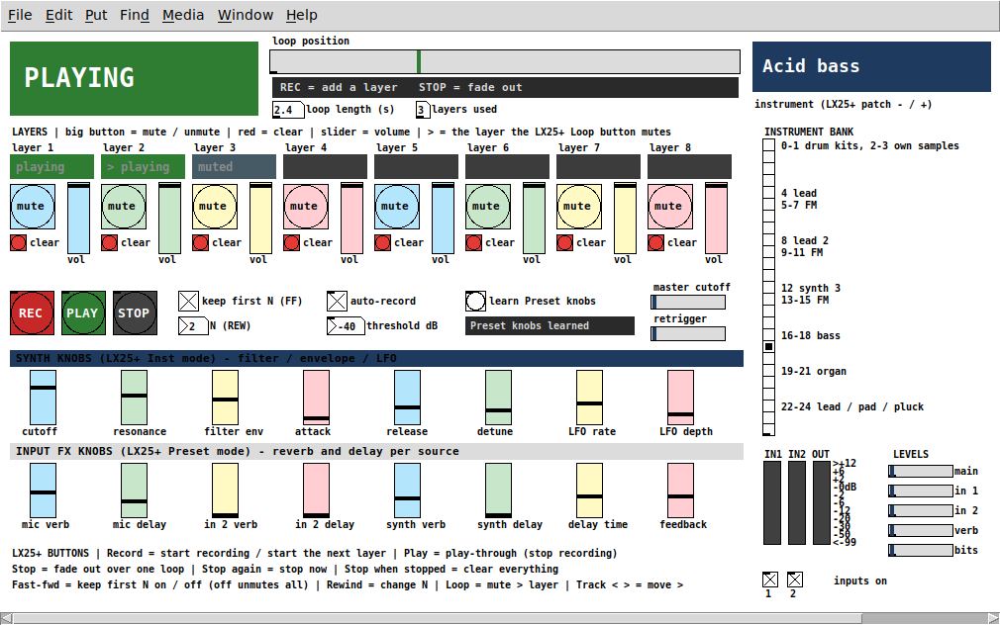
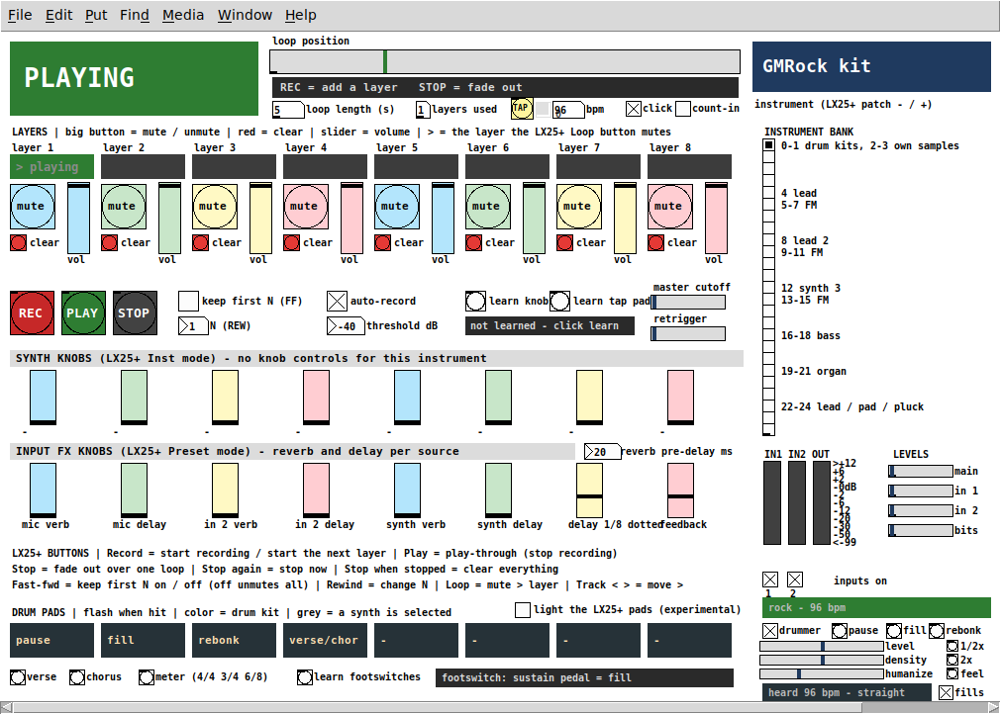

# LiveLoopSynth user manual

LiveLoopSynth is a live looper with drum kits, synths and effects. You play it from a Nektar Impact LX25+ keyboard, record through a Behringer UMC22 audio interface, and it runs on a Mac or a Raspberry Pi with a monitor. You build a song by stacking up to 8 **layers** over one loop. Everything you play is heard live, and it's only added to the loop while you're recording.

## 1. Starting up

| | Mac | Raspberry Pi |
|---|---|---|
| Start | Double-click `scripts/run-mac.command`. Keep its Terminal window open: it runs the AI drummer's brain (section 11). | `scripts/run-pi.sh`, or automatically at login if you ran `scripts/setup-pi.sh --autostart` |
| Phone remote | Also run `python3 remote/server.py` | `scripts/run-pi.sh --remote` (or `--headless`: no Pd window). See [section 10](#10-the-web-remote-phone-or-tablet). |
| First time only | In Pd: **Media → Audio Settings**, pick the UMC22 (it may show as *USB Audio CODEC*) for input and output at 48000 Hz. **Media → MIDI Settings**, pick *Impact LX25+*. Click **Save All Settings** in both. Allow microphone access if macOS asks. | Nothing: the script finds the UMC22 and the LX25+ itself. |

Plug the UMC22 and the LX25+ in before you start. When the window opens, the big box in the top-left says **READY**.

The UMC22 has two inputs:

- **Input 1:** the XLR mic socket.
- **Input 2:** the 1/4" instrument/line socket.

Set their gain with the knobs on the UMC22. The **IN1/IN2** meters in the bottom-right show the signal, and the two **inputs on** tick boxes under them switch each input into the looper (both start on).

## 2. The screen

**Top row: what the looper is doing**

- **State box (top-left).** A big, color-coded word:

  | State | Color | Meaning |
  |---|---|---|
  | READY | grey | empty, waiting for you to play |
  | RECORDING | red | recording the first layer, which sets the loop length |
  | OVERDUB | orange | adding to a layer |
  | PLAYING | green | looping, not recording (play-through) |
  | FADING | blue | fading out |
  | STOPPED | dark | stopped |

- **Hint line.** Under the position bar, it says what the next button press will do.
- **Loop position.** The marker sweeps from left to right once per loop. While you record the first layer it shows how much of the 20-second maximum you've used.
- **Loop length (s)** and **layers used.**
- **Tempo controls:**
  - **TAP** and its light.
  - **bpm:** type a value, or 0 for no tempo.
  - **click** and **count-in** switches.

  See section 5.
- **Instrument box (top-right).** The instrument the keys and pads are playing.

**LAYERS: eight columns, one per layer**

- **The colored cell** shows each layer's state:

  | Cell | Meaning |
  |---|---|
  | empty | nothing recorded |
  | playing | has sound and is audible |
  | REC | being recorded right now |
  | muted | silenced by you or by "keep first N" |

  A **>** in front marks the layer the LX25+ **Loop** button will mute.
- **mute** (big round button): mute/unmute that layer.
- **clear** (small red button): erase that layer.
- **vol**: the layer's volume.

**Looper controls**

- **REC**, **PLAY** and **STOP** do the same as the LX25+ transport buttons (next section).
- **keep first N** and **N**: see section 6.
- **auto-record** and **threshold dB**: see section 4.

**Knob rows.** Two rows of eight sliders, which follow the LX25+ knobs. The row the knobs last moved is highlighted.

- **SYNTH KNOBS (Inst mode):** sound settings for the selected instrument. The labels change with the instrument (section 7).
- **INPUT FX KNOBS (Preset mode):** reverb and delay amounts for the mic input, input 2 and the synths/drums, plus delay time and feedback (section 7).

Next to the looper controls are **learn knobs** (section 7) and two master effects. **Master cutoff** is a low-pass filter over everything you play: lower it for a darker, muffled sound. **Retrigger** is a stutter effect that repeats short slices in time with the loop.

**DRUM PADS.** A row of eight pads that flash when you hit them. They're colored by drum kit: GMRock orange, Virtuosity teal, your own kits 2 and 3 purple and blue. They turn grey when a synth is selected, because the pads then play that synth. With the **AI drummer** on, they turn dark and show its controls instead: **pause**, **fill**, **rebonk** and **verse/chor** (section 11).

**Right column**

- **INSTRUMENT BANK:** the selected instrument is filled in. Change it with the LX25+ **Patch − / +** buttons.
- **Meters:** IN1, IN2 and OUT.
- **LEVELS:** display only. They show main volume, input gains and FX sends.
- **AI drummer** (bottom): its status line, the **drummer** switch, **pause**, **fill**, **rebonk**, and its **level**, **density** and **humanize**. Next to and below them: the **1/2x**, **2x** and **feel** corrections, what it heard (tempo and feel), and the **fills** switch. Under the drum pads: **verse**, **chorus**, **meter** and **learn footswitches**. See section 11.

## 3. LX25+ controls

| LX25+ control | What it does |
|---|---|
| **Keys / pads** | Play the selected instrument (drum kits respond to the pads and to keys C3-D#4). The pads play the drum kits (see [kits/README](../piLooper/kits/README.md) for the pad layout). With the AI drummer on, pads 1–4 control it instead (section 11). A sustain pedal plays a drummer fill (section 11). |
| **Record** | Start recording. Press again to set the loop length and start the next layer. Each later press starts a new layer. |
| **Play** | Play-through: stop recording and keep the loop going, so you can play along without adding to it. It also restarts after a Stop. |
| **Stop** | Fade out over one loop, then stop. **Press again** to stop immediately. **Press while stopped** to clear everything. |
| **Fast-forward** | Keep first N on/off (section 6). Turning it off also unmutes every layer. |
| **Rewind** | Change N (1 → 2 → … → 7 → 1). |
| **Pad 8 on pad map 2** | **Tap tempo** while the looper is READY. While the first layer records, it **completes the loop** (same as Record), so you can close a loop without leaving the pads. |
| **Loop** | Mute/unmute the layer marked **>**. |
| **Track < / >** | Move the **>** marker to another layer. |
| **Patch − / +** | Change instrument (25 banks, listed in the right column). |
| **Pitch wheel** | Bends synth notes up to an octave up or down (analog synths, organs, FM presets). |
| **Mod wheel** | Vibrato on the analog synths and organs. |
| **Knobs 1–8** | Depends on the LX25+ knob mode (the **Mixer / Inst / Preset** buttons): **Inst** = synth sound, **Preset** = input reverb/delay, **Mixer** = layer volumes. See section 7. |
| **Fader** | Volume of layer N, where N is the MIDI channel the fader sends on (1–8). |

The patch expects these messages on MIDI channel 16 (the LX25+ in its DAW/Pd setup): Record CC 107, Play 106, Stop 105, Fast-forward 104, Rewind 103, Loop 102, Track < / > CC 109 / 110, Patch − / + CC 111 / 112, Inst-mode knobs CC 56–63. Preset-mode knobs are learned (section 7). If a button does nothing, watch the Pd console: the `midi-raw` lines show what each control actually sends.

### Lighting the LX25+ pads (experimental)

The screen always shows the pads lighting up. Whether the LX25+'s own pads can be lit by the software is untested; it depends on the keyboard accepting incoming MIDI. To try it:

1. **Connect the patch's MIDI output to the keyboard.** On the Pi, `run-pi.sh` does this for you. On the Mac, set **Media → MIDI Settings → Output device 1** to *Impact LX25+*.
2. **Tick "light the LX25+ pads (experimental)"** above the pad row.

Each pad hit is then sent back to the keyboard as a note with a different velocity per kit. If the pads light (or change color), it works. If nothing changes, the keyboard ignores incoming MIDI; untick it, and nothing is harmed.

## 4. Recording a loop, step by step

1. **Get to READY.** If the screen doesn't say READY, press **Stop** until it does. Stop fades out, then stops, then clears.
2. **Just start playing.** With **auto-record** ticked, recording starts on your first note (keys or pads) or when an input goes over the **threshold** (−40 dB by default). You can also press **Record** to start. The box turns red: **RECORDING**.
   - For about one second after clearing, auto-record ignores sound, so reverb tails don't trigger it.
   - If the room is noisy, raise the threshold (e.g. −30). If quiet playing doesn't trigger it, lower it.
3. **Press Record at the end of your phrase.** That moment sets the loop length (up to about 20 s), and the loop starts playing straight away. You're now in **OVERDUB** on layer 2: anything you play is added to layer 2 on every pass.
4. **Press Record again** to finish layer 2 and start layer 3, and so on up to 8 layers. A new layer starts exactly where you are in the loop, so there's no waiting for the downbeat.
5. **Press Play** when you want to jam over the loop without recording it (**PLAYING**, green). Press **Record** at any time to add another layer.
6. **Press Stop** to fade out over one loop. Press **Stop** again during the fade to cut immediately. Press **Play** to start again from the top, or **Stop** once more to clear everything and return to READY.

Overdub adds on every pass: if you keep playing the same part while a layer records, it gets louder each time around. Press **Record** (next layer) or **Play** (play-through) when a layer sounds right.

## 5. Tempo: tap, bar snapping, click and count-in (optional)

Without a tempo the looper works as described above: the loop is exactly as long as you play it (a *natural* loop). Set a tempo and loops become *timed*.

1. **Tap the tempo while the looper shows READY.** Tap pad 8 on pad map 2 (or click **TAP**) in time, four or more times. The bpm box shows the tempo from the second tap onward. It averages your last four taps, ignores a tap that's way off, and starts a fresh count after a 2-second pause. You can also type a bpm into the box; type 0 to go back to natural loops.
2. **Record as usual.** When you close the first layer (Record, or the tap pad), the loop length **snaps to the nearest whole number of bars** (4/4). Close a little early and it keeps recording to the bar line. Close a little late and playback carries on from the right place. Either way, the loop is in time.
3. **Click:** with **click** ticked, a metronome plays while the first layer records. The downbeat is higher-pitched. The click goes to the speakers only and is never recorded, and it stops once the loop plays.
4. **Count-in:** with **count-in** ticked, pressing **Record** in READY gives one bar of clicks (the hint line counts 1-2-3-4), then recording starts on the downbeat. Auto-record doesn't use the count-in, because it starts on your first note.
5. **The tempo is locked** once a loop exists; tapping then shows "tempo is locked". Clear everything (Stop until READY) to set a new one.

**With a tempo set:**

- **Natural loops:** the tap pad is also a hands-free "finish the loop" trigger while the first layer records.
- **Delay time:** Preset knob 7 picks a note value (1/16, 1/8, dotted 1/8, 1/4, dotted 1/4, 1/2). The slider label shows which.

**The tap pad.** By default it's note 55 on MIDI channel 10 (pad 8, pad map 2). It's silent: tapping plays no drum or synth note and doesn't start auto-record. If your keyboard sends something different, click **learn tap pad** and hit the pad; the patch remembers it (`piLooper/tappad.txt`). If the **G3 key** goes quiet, your pads and keys share a MIDI channel: set the LX25+ pads to their own channel and learn the tap pad again.

## 6. Breakdowns: keep first N

**Keep first N** mutes every layer above N with one press, and brings them back with the next. It's handy for a breakdown that drops back to, say, just the drums and bass.

1. Press **Rewind** until **N** shows how many layers to keep. For example, N = 2 keeps layers 1 and 2.
2. Press **Fast-forward**. Layers above N show **muted**. In the screenshot above, layer 3 is muted and layers 1–2 keep playing.
3. Press **Fast-forward** again to bring everything back. This also unmutes any layers you muted by hand.

To mute or unmute single layers, click a layer's **mute** button, or use **Track < / >** to move the **>** marker and press **Loop**.

## 7. The knobs

The LX25+ knob-mode buttons pick what the eight knobs do.

### Inst mode: shape the synth you're playing

The knobs control the instrument selected in the INSTRUMENT BANK:

| Instrument | Knob 1 | 2 | 3 | 4 | 5 | 6 | 7 | 8 |
|---|---|---|---|---|---|---|---|---|
| Basses, Supersaw, Warm pad, Pluck (banks 16–18, 22–24) | cutoff | resonance | filter env | attack | release | detune | LFO rate | LFO depth |
| Organs (banks 19–21) | 16' | 5 1/3' | 8' | 4' | 2 2/3' | 2' | 1 3/5' | 1 1/3' |
| FM presets (banks 5–7, 9–11, 13–15) | mod 1 amt | mod 2 amt | cross mod | attack | decay | release | LFO rate | LFO depth |
| Drum kits and the lead synths | – | | | | | | | |

- **When changes apply:** cutoff, resonance, filter env, detune and the drawbars change the sound immediately, even on held notes. Attack and release apply from the next note.
- **LFO:** LFO depth wobbles the filter, and LFO rate sets the speed.
- **Selecting an instrument restores its preset sound.**

**Wheels:**

- **Pitch wheel:** bends the analog synths, organs and FM presets up to an octave up or down.
- **Mod wheel:** adds vibrato to the analog synths and organs.

Neither affects the lead synths (banks 4, 8 and 12) or the drums.

### Preset mode: reverb and delay on your inputs

| Knob | 1 | 2 | 3 | 4 | 5 | 6 | 7 | 8 |
|---|---|---|---|---|---|---|---|---|
| | mic reverb | mic delay | input 2 reverb | input 2 delay | synth/drums reverb | synth/drums delay | delay time | delay feedback |

Each source has its own reverb and delay amount, and they share one reverb and one delay. Delay time runs from about 60 ms to 1.5 s, or follows the tempo (section 5). **Reverb pre-delay** (next to the INPUT FX title, 0-250 ms, default 20) sets how long the reverb waits before it starts, which keeps vocals and instruments clear in front of the reverb. The effects are recorded into the loop along with the dry sound.

**One-time setup: teach the patch your Preset-mode knobs.** The patch doesn't know in advance what the LX25+ sends in Preset mode, so:

1. Press **Preset** on the LX25+.
2. Click **learn knobs** on screen. The box next to it says *turn Preset knob 1*.
3. Turn knob 1, then knob 2, and so on up to knob 8. The box counts along and then shows *Preset knobs learned*.

This is saved in `piLooper/knobmap.txt` and loads at every start. To redo it, click **learn knobs** again.

### Mixer mode

The knobs and fader set layer volumes, as before.

The **mouse** works too: dragging any knob-row slider does the same as turning the knob.

## 8. Instruments

| Bank | Instrument | Bank | Instrument |
|---|---|---|---|
| 0 | GMRock kit | 16 | Moog bass |
| 1 | Virtuosity kit | 17 | Acid bass |
| 2–3 | Your own drum samples | 18 | Reese bass |
| 4 | Lead synth | 19 | Jazz organ |
| 5–7, 9–11, 13–15 | FM synth presets | 20 | Gospel organ |
| 8 | Lead synth 2 | 21 | Church organ |
| 12 | Synth 3 | 22 | Supersaw lead |
| | | 23 | Warm pad |
| | | 24 | Pluck |

You can change instrument while a layer is recording, for example to record a bass line and then pads into the next layer.

## 9. Saving and loading songs

Songs are saved as folders under `piLooper/Sessions/`, one audio file (stem) per layer plus the loop length. Loading a song brings back its layers and loop length. The looper then shows **STOPPED**, so press **Play**.

**Not yet mapped:** save, load, new song and song select were driven by the old Teensy front panel, and no LX25+ button triggers them yet.

## 10. The web remote (phone or tablet)

You can control everything on the main screen from a phone, a tablet or another computer's browser.

1. Start the Pi with `scripts/run-pi.sh --remote` (the Pd window as well) or `scripts/run-pi.sh --headless` (no Pd window). On the Mac, start the patch and run `python3 remote/server.py`.
2. On your phone, joined to the same Wi-Fi, open `http://raspberrypi.local:8080/` (use your Pi's name). The script also prints the address.
3. Optional: use **Add to Home Screen** in the browser menu, so it opens full-screen like an app.

- **Top bar:** it stays on screen while you scroll. It has the state (READY, RECORDING and so on), the loop position, **REC / PLAY / STOP**, **TAP**, the tempo (− / + or type a number, 0 = free time), and the click and count-in switches. The buttons react on touch, not on release, so they land on the beat.
- **Layers:** tap the round button to mute or unmute a layer, and × to clear it. Drag the fader to set its volume, or touch the fader where you want it. ▸ marks the layer the LX25+ Loop button mutes.
- **Knobs:** drag up or down (sideways works too). Double-click resets a knob. The dot on the **Synth** / **Input FX** tab shows which page the LX25+ knobs are on, and the page turns to follow the knobs.
- **Instrument:** use ‹ › or the list.
- **Master:** main and input gain, master cutoff, retrigger, reverb pre-delay, the meters, and the input switches.
- **Looper:** keep first N, auto-record and its threshold, and the learn buttons.
- **AI drummer:** the on switch, its status line, **pause / resume**, **fill**, **rebonk**, and its level, density and humanize (section 11).
- **Drum pads:** they light up when you hit the LX25+ pads. They don't play sounds from the phone.

The dot in the top-right corner is green when the page is connected to Pd. If it turns red, the page reconnects by itself.

## 11. The AI drummer

The AI drummer plays a drum part along with your loop, on the drum kit you picked last (banks 0–3; it keeps that kit while you play a synth). It is **heard but never recorded**: it doesn't end up in your layers or your saved song, so you can switch it on, off or pause it whenever you like.

1. Tick **drummer** (bottom right, or the switch on the web remote). The status line says *on - waiting for a loop*.
2. Record your first layer as usual. **While it records, the drummer listens**: the line under the status says *listening to layer 1...*.
3. When the loop plays, the drummer comes in on the downbeat. Within a moment it has worked out the tempo and the feel. The status line shows the groove and tempo, for example *funk - 96 bpm*, and the line below shows what it heard, for example *heard 96 bpm - swing 62%*.

### What it listens for

From your first layer it works out:

- **the meter:** **4/4**, **3/4** (a waltz) or **6/8** (two groups of three 8ths, like a slow blues or a ballad in 12/8). It goes by where your strong notes fall: every 4 beats, every 3, or in threes of 8th notes.
- **the tempo:** how many bars are in the loop. With a tapped tempo (section 5) it uses yours. In 6/8 the tempo counts the dotted quarters (two beats per bar).
- **the swing:** where your off-beats fall, from straight (50%) to a full triplet shuffle (67%). It also copies whether you play a little ahead of the beat or lay back.
- **the groove:** in 4/4, busy 16ths get *funk*, a low note on every beat *four on the floor*, sparse playing *half-time*, a swung feel the *ride*, and everything else *rock*. In 3/4: *waltz* (sparse), *jazz waltz* (swung) or *3/4 rock*. In 6/8: *6/8 ballad*, *6/8 rock* (busy) or *6/8 blues*. It also puts kicks under your strongest low notes and fills the gaps you leave rather than playing over your accents.

It listens to everything that goes into the loop (microphone, guitar, synths) and takes the notes you play on the keys and pads straight from MIDI, which is exact.

**If it got it wrong**, correct it with the buttons next to the sliders (also on the web remote):

| Button | What it does |
|---|---|
| **1/2x** | Half the tempo (it heard your 8th notes as beats). |
| **2x** | Double the tempo (it heard every other beat). |
| **feel** | Steps through *as heard*, *straight*, *swing* and *triplet* (4/4 and 3/4). |
| **meter** | The next meter: 4/4 → 3/4 → 6/8 (under the drum pads; also on the web remote). Going between 4/4 and 3/4 or 6/8 keeps the beat; between 3/4 and 6/8 it keeps the bar. |

A tapped tempo avoids most tempo mistakes. Changes take effect at once, and the drummer stays in time. A shuffle can come out as 6/8 and a sparse waltz as 6/8 at half speed. That's what **meter** and **1/2x** / **2x** are for.

### Verse and chorus

The drummer knows two song parts, each with its own groove:

- **verse:** the groove it heard, as above.
- **chorus:** the same groove, bigger: busier, on the ride instead of the hi-hat (rock and half-time), with a crash at the start of every pass. **rebonk** while the chorus plays gives the chorus a groove of its own.

Click **verse** or **chorus** (under the drum pads, or on the web remote), or hit pad 4 or a footswitch to go to the other part. While it plays, the drummer finishes the bar with a fill and starts the new part on the next bar line, so you can call the change a beat or two early. The status line ends in *- chorus* while the chorus plays. Your loop doesn't change; it's the drums that lift the song. Clearing the song goes back to the verse.

### Different on every pass

It plays a little differently on every pass, like a real drummer: ghost notes and extra kicks come and go, and the hi-hat opens at the turnaround. The changes are gradual, so it still sounds like the same groove.

- **Fills:** with **fills** ticked (*auto fills* on the web remote), it plays a fill every 8 bars (every 4 when it's busy), always ending on the loop's end, and crashes into the next downbeat.
- **It follows the band:** as you add layers it gets busier, and with four or more layers playing, rock and half-time move from the hi-hat to the ride. When keep-first-N (section 6) mutes layers, it calms down again.

Two sliders shape it:

- **density:** how busy it is. At the left it plays only the backbone (kick, snare, hats on the beat at the very bottom). The middle is the groove as written, and at the right it adds lots of ghost notes and extra kicks.
- **humanize:** how loose it is. It moves hits a few milliseconds off the grid (the kick stays tight, the snare sits a touch behind) and lets the velocities breathe. At the left it plays exactly on the grid.

### The drummer brain

The listening and the variation come from a small helper program, the **drummer brain** (`drummer/brain.py`). `run-pi.sh` starts it for you. On the Mac, `run-mac.command` runs it in its Terminal window, so keep that window open. Without the brain:

- the status line ends in ***- fixed***, and the drummer repeats the same pattern every pass
- it doesn't listen (*not listening (no brain)*): it guesses the bars from the loop length, assuming about 100 bpm in 4/4, or uses your tapped tempo
- it stays in 4/4 (the meter comes from the brain), there are no auto fills, the chorus is just the same fixed groove, and rebonk simply steps to the next groove

Slider changes and rebonk take effect from the next pass.

### The pads as controls

While the drummer is on, **the drum pads become its controls** and stop playing the kit:

| Pad | What it does |
|---|---|
| **1 pause** | Pause: it stops on the next beat. Hit again to resume: it comes back in on the next bar line, so it's always in time. |
| **2 fill** | A fill on the last beat of the bar, then an accent on the next downbeat. |
| **3 rebonk** | Change up the groove: it listens to the whole band (all your layers plus what you're playing) for one loop, then switches to a different groove that fits, in the same meter. |
| **4 verse/chor** | Go to the other song part (verse ↔ chorus), with a fill into it. |
| 5–7 | Nothing yet. |

It's the same on both pad maps, and pad 8 on pad map 2 is still the tap pad. The keys play as usual, including the kit when a drum bank is selected. **pause**, **fill**, **rebonk**, **verse** and **chorus** are also on screen and on the web remote. Untick **drummer** to hand the pads back to the kit.

- **Level:** the **level** slider sets the drummer's volume. It also follows the main volume.
- **Stop:** the drummer fades out with the loop and stops with it. It comes back in when the loop plays again. Clearing the song makes it forget what it heard.
- **Mic and speakers:** the drummer comes out of your speakers, so a microphone can pick it up while you overdub. Use headphones, or pause the drummer while you record through the mic. It also hears itself that way when you rebonk.

The pads are told apart from the keys by their MIDI channel, which the patch takes from the tap pad (channel 10 by default). If the pads keep playing drums with the drummer on, **learn tap pad** again (section 5).

### Footswitches

Control the drummer with your feet: any MIDI footswitch that sends a control change (CC) or a program change works, for example a sustain pedal plugged into the LX25+, or a MIDI foot controller.

- **Out of the box:** a sustain pedal in the LX25+ (CC 64) plays a **fill**.
- **Learn your own:** click **learn footswitches** (under the drum pads). The line next to it asks for each action in turn: press the footswitch for **pause**, then **fill**, **rebonk** and **verse/chorus**. Click **learn footswitches** again to stop early; the actions you skipped keep what they had. The switches are saved in `piLooper/footswitch.txt` and loaded every time.

A switch counts when it sends a value of 64 or more (a press), so set momentary switches to send 127 when pressed and 0 when released. Program changes count every time. The switch matches on its channel too. Footswitches work whether or not the drummer is playing: pause needs the drummer on, a fill needs it playing, and verse/chorus can be set up before the loop starts.

## 12. Troubleshooting

| Problem | Try |
|---|---|
| No sound from the inputs | Check the UMC22 gain knobs, the **inputs on** ticks and the IN1/IN2 meters. On a Mac, allow microphone access for Pd (System Settings → Privacy & Security → Microphone). |
| Preset-mode knobs do nothing | Do the one-time learn in section 7. |
| G3 key is silent | Your pads and keys share a MIDI channel; see *The tap pad* in section 5. |
| Auto-record starts on its own | Raise the **threshold**, or untick **auto-record** and use the Record button. |
| Auto-record doesn't start | Lower the threshold, or press **Record**. |
| Pads play the kit with the AI drummer on, or don't control it | The patch finds the pads by the tap pad's MIDI channel: click **learn tap pad** and hit pad 8 (pad map 2). |
| The drummer plays at double or half speed, or swings when you don't | It misheard your first layer. Use **1/2x**, **2x** or **feel** (section 11), or tap the tempo before you record. |
| The drummer plays in 3 when the song is in 4 (or the other way) | Click **meter** until it's right (4/4 → 3/4 → 6/8). |
| A footswitch does nothing, or triggers on release | Learn it again (**learn footswitches**), and set it to momentary, sending 127 when pressed. |
| The drummer's status ends in "- fixed" | The drummer brain isn't running, so the pattern doesn't change from pass to pass. Start the patch with `scripts/run-pi.sh` (or `run-mac.command` on the Mac, and keep its window open), or run `python3 drummer/brain.py` yourself. |
| Drums sound out of tune | Pd must run at 48 kHz (Media → Audio Settings on a Mac; the Pi script sets it). |
| The phone can't open the remote | Check the phone is on the same Wi-Fi and use the address the script prints (the IP address works when `.local` names don't). |
| Clicks or crackles on the Pi | Start with a bigger buffer: `AUDIO_BUF=40 scripts/run-pi.sh`. |
| The LX25+ does nothing on the Pi | Run `scripts/run-pi.sh --list` to check the keyboard is listed, then restart the script. |
| A layer won't record | All 8 layers are used ("layers used" = 8). Clear a layer with its red button, or press Stop twice and Stop again to start over. |
